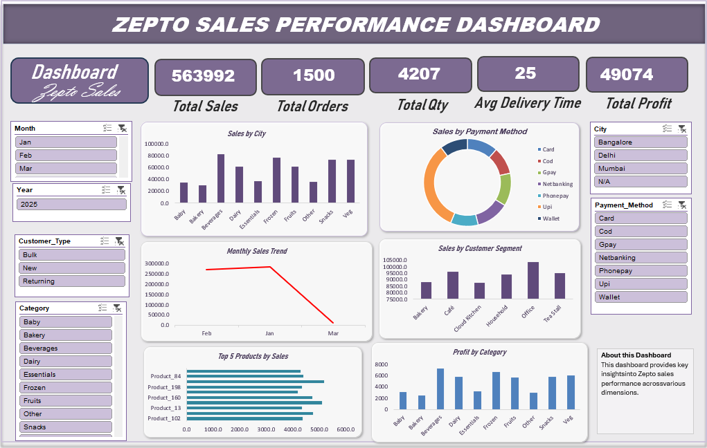
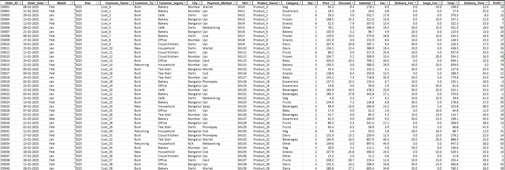

# Zepto Sales Performance Dashboard

📊 An interactive Excel dashboard built to understand Zepto's sales performance, customer behavior, product performance, and delivery trends.

## Project Preview

## Project Overview

I created this project to analyze Zepto sales data and turn it into an easy-to-understand Excel dashboard.

The dashboard gives a quick view of sales, orders, profit, products, categories, customers, cities, payment methods, and delivery performance. It also allows users to filter the data and explore different sales trends.

## From Data to Dashboard

I started with raw Zepto sales data and prepared it for analysis in Excel. After organizing and analyzing the data, I used PivotTables, PivotCharts, formulas, slicers, and KPI cards to build the final dashboard.

The main focus was to make the dashboard simple to use while still providing useful business insights.

### Source Data

The dataset includes information about:

- Order ID
- Order Date
- Customer Name
- Customer Type
- Customer Segment
- City
- Payment Method
- SKU
- Product Name
- Category
- Quantity
- Price
- Discount
- Subtotal
- Tax
- Delivery Fee
- Surge Fee
- Total Sales
- Delivery Time
- Profit

## Dashboard Features

- 📌 Interactive slicers for Month and Year
- 👥 Customer Type and Customer Segment analysis
- 🛍️ Product and Category performance
- 🏙️ City-wise sales analysis
- 💳 Payment Method analysis
- 💰 Total Sales and Profit KPIs
- 📦 Total Orders and Quantity KPIs
- 🚚 Average Delivery Time
- 📈 Monthly Sales Trend
- 🏆 Top 5 Products by Sales
- 📊 Profit by Category
- 📊 Interactive PivotCharts

## Key KPIs

| KPI | Value |
|---|---:|
| Total Sales | 563,992 |
| Total Orders | 1,500 |
| Total Quantity | 4,207 |
| Average Delivery Time | 25 |
| Total Profit | 49,074 |

> These values represent the overall dashboard view. The values change when filters or slicers are applied.

## Business Questions

The dashboard was created to answer questions like:

- How much total sales did the business generate?
- How many orders were placed?
- Which products are performing best?
- Which categories generate more profit?
- Which cities contribute the most sales?
- Which payment methods are used most often?
- Which customer segments generate higher sales?
- How do sales change over time?
- What is the average delivery time?
- Which products and categories need more attention?

## Files Included

| File | Description |
|---|---|
| `zepto-sales-dashboard.xlsx` | Excel dashboard |
| `dashboard-image.png` | Final dashboard preview |
| `dashboard-sketch.png` | Initial dashboard layout |
| `data.png` | Source data preview |
| `README.md` | Project documentation |

## How to Use

1. Download `zepto-sales-dashboard.xlsx`.
2. Open the file in Microsoft Excel.
3. Go to the `Dash` worksheet.
4. Use the available slicers and filters.
5. Select different months, years, categories, cities, customer types, or payment methods.
6. Explore the KPIs and charts to understand the sales performance.

[📥 Download the Excel Dataset](zepto_sales.xlsx)

> For the best experience, download the workbook and open it in Microsoft Excel. The interactive features may not work directly in GitHub's preview.

## Tools & Skills

- Microsoft Excel
- Data Cleaning
- Excel Formulas
- PivotTables
- PivotCharts
- Slicers
- KPI Cards
- Data Analysis
- Data Visualization
- Dashboard Design
- Business Analysis
- Sales Analysis

## Project Outcome

This project helped me practice working with raw business data and turning it into a useful dashboard.

The final dashboard makes it easier to identify sales trends, understand customer and product performance, compare categories and cities, and track overall profitability.

## Author

**Sanjai**

🎓 Data Analytics Student
